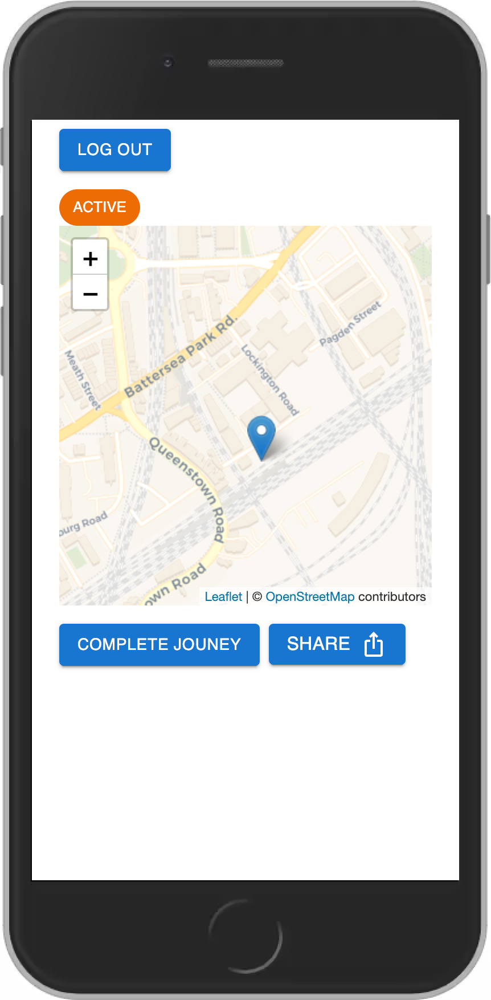

<div align="center">
<h1 align="center">track-api</h1>
 <strong>
   🚶
 </strong>
</div>

<br />

<div align="center">
  <!-- docs.rs track-ui repository -->
  <a href="https://github.com/cobbinma/track-ui">
  
  </a>
 <br />
 
</div>

## development

### run
```shell
make run
```

### test
```shell
make test
```

### generate
```shell
make gen
```